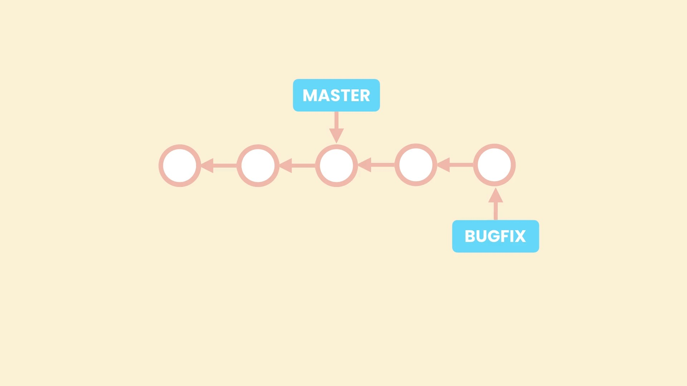

# Comprehensive git

## customize shell

- on linux and mac we can use OH MY ZSH to customize look of shell(show status of git repo)
- on windows we can use Oh My Posh <small>(we can also use oh my zsh on windows which is a little bit tricky and not fully compatible)</small>

## about commands in command line

1. Command Line Flags:

   - Short flags are typically represented by a single hyphen (`-`) followed by a single letter. For example: `-h`.
   - Word flags are represented by two hyphens (`--`) followed by a word or multiple words separated by hyphens. For example: `--help` or `--no-edit`.
   - Quotes are used to group words together as a single argument when there are spaces involved.for example: `git commit -m "initial commit"`

2. Assigning Values to Flags:

   - Values can be assigned to flags using an equal sign (`=`) or by directly placing the value after the flag.

   **Example:**

   - `git config --global user.name "John Doe"` - Sets the global Git username to "John Doe".
   - `git config --global user.name="John Doe`

3. Separating Flags from Values:

   - When a command has both flags and values, it's important to use `--` to separate them. This is necessary when a value (like a file or directory path) could be mistaken for a flag.for example:

   - `git diff HEAD~1 HEAD -- file.txt` - Shows the diff between the most recent commit and its parent commit for a specific file.

## gui tools to work with git

- **gitkraken** (free for open source projects)
- **sourcetree** (free)

## Key Terms

- **Version Control System (VCS) or Source Code Manager (SCM):** A VCS allows you to:

  - revert files back to a previous state
  - review changes made over time
  - collaborate with others
  - see who last modified something that might be causing a problem

- **Commit (snapshot):** Git thinks of its data like a set of snapshots of a mini file system.
  Every time you commit, or save the state of your project in Git, it basically takes a
  picture of what all your files look like at that moment and stores a reference to that
  snapshot.
- **Repository (repo):** A directory that contains your project work, as well as a few files (hidden by default in Mac OS X) which are used to communicate with Git. Repositories can exist either locally on your computer or as a remote copy on another computer.

- **Working Directory:** The files that you see in your computer's file system. When you open your project files up on a code editor, you're working with files in the Working Directory.This is in contrast to the files that have been saved (in commits!) in the repository. When working with Git, the Working Directory is also different from the command line's concept of the current working directory which is the directory that your shell is "looking at" right now.

- **Checkout:** When content in the repository has been copied to the Working Directory. It is possible to checkout many things from a repository; a file, a commit, a branch, etc.

- **Staging Area or Index or cache:** A file in the Git directory that stores information about what will go into your next commit. You can think of the staging area as a prep table where Git will take the next commit. Files on the Staging Index are ready to be added to the repository.

- **SHA:**(stands for Secure Hash Algorithm) A SHA is basically an ID number for each commit. It is a 40-character string composed of characters (0–9 and a–f) and calculated based on the contents of a file or directory structure in Git. "SHA" is shorthand for "SHA hash". A SHA might look like this:
  e2adf8ae3e2e4ed40add75cc44cf9d0a869afeb6

- **Branch:** A branch is when a new line of development is created that diverges from the main line of development. This alternative line of development can continue without altering the main line.

## help

we can use `--help` after each command to get options with full explanation and `-h` to get a short explanation like:

```shell
git config --help
git config -h
```

## config

The Git config file is a configuration file that stores various settings for your Git repositories. It allows you to customize your Git environment and behavior. The config file is specific to each Git repository and can also have global settings that apply to all repositories on your system.

There are three levels of config files:

1. System-level config: Applies to all users on the system and is stored in the `/etc/gitconfig` file.

2. User-level config: Applies to a specific user and is stored in the `~/.gitconfig` or `~/.config/git/config` file.(use `git config --global -e` to open global config, use `git config --global --list` to list all configured options)

3. Repository-level config: Applies to a specific Git repository and is stored in the `.git/config` file within the repository directory.

The config file uses the INI file format, with sections and key-value pairs. Here is an example of a Git config file:

```ini
[user]
    name = John Doe
    email = johndoe@example.com

[core]
    editor = nano
```

In this example, the `[user]` section contains the user's name and email address, while the `[core]` section specifies the default text editor to use.

You can modify the config file manually by editing it with a text editor, or you can use Git commands to update the settings. For example, you can use the `git config` command to set or get specific configuration values.

To set a configuration value, you can use the following command:

```shell
git config <key> <value>
```

For example, to set your name, you can use:

```shell
git config user.name "John Doe"
```

set vscode as default editor:

```shell
git config --global core.editor "code --wait"
# --wait tells the terminal window wait until we close the new vscode instance
```

To get a configuration value, you can use the following command:

```shell
git config <key>
```

For example, to get your email address, you can use:

```shell
git config user.email
```

Overall, the Git config file is a powerful tool to customize your Git workflow and manage your repository-specific or global settings.

## important note about newline

newline in UNIX like operating systems(mac, linux,...) is line feed(**lf**):`\n` and in windows is carriage return line feed(**crlf**): `\r\n`
we have to configure `core.autocrlf` in global config:

- in windows set it to `true`: `git config --global core.autocrlf true`
- in mac set it to `input`: `git config --global core.autocrlf input`

this makes sure that git will remove \r when we check in code to repo(in repo we have newlines as `\n`) and add \r when we check out code from repo in windows and in mac git don't touch new line when we check out code from repo but if we accidentally added \r to code git makes sure to remove it when we check in code to repo.

## Initializing a repository

first step is to initialize a git repo with `git init` command.

## basic and common commands

```shell
git add file1.txt # add changes to index
git commit -m "message" # commit changes
```

## a common misconception

a misconception is when we commit changes the staging area becomes empty, but in fact staging area won't change until we change it with `git add` command after making changes to working directory

## listing tracked files

`ls` lists files in working directory and `git ls-files` lists tracked files

## removing files and folders

- `rm file2.txt` - removes file from working directory but it is still in index, we should `git add file2.txt` to remove file from index
  instead of doing this two commands we can write `git rm file2.txt` so it removes file2.txt from working directory and index
- we use `-r`(for removing recursively(<small>removing nested files and folders</small>)) for removing folders
  `rm -r folder1`, `git rm -r folder1`
- `git rm --cached <filename>` to remove a file from the index(untrack file) without deleting it from the working directory

## .gitignore

A gitignore file specifies intentionally untracked files that Git should ignore. Files already tracked by Git are not affected, we can use `git rm --cached <filename>` to make git not track a previously tracked file

## glob

- in programming, a glob(/ɡlɒb/) is a pattern-matching notation used to match filenames or pathnames.
- glob is very similar to regex but regex is more flexible and is used for matching strings

| Wildcard | Description                                | Example               |
| -------- | ------------------------------------------ | --------------------- |
| `#`      | Matches comments (ignored in patterns)     | `# This is a comment` |
| `*`      | Matches zero or more characters            | `*.txt`               |
| `?`      | Matches any single character               | `file?.txt`           |
| `**`     | Matches nested directories and files       | `src/**/test/*.js`    |
| `[abc]`  | Matches any character in the set           | `[abc].txt`           |
| `[a-f]`  | Matches any character in the range         | `[a-f].txt`           |
| `!`      | Negates a pattern, excludes matching files | `!temp.txt`           |

glob's usage in Git:

1. `.gitignore` file: Git uses globs in the `.gitignore` file to specify which files or directories should be ignored and not tracked by Git. This allows you to exclude specific files or patterns from being included in the Git repository.

2. Git commands: Some Git commands, such as `git add` and `git rm`, accept glob patterns as arguments. These patterns can be used to specify which files or directories should be added to the staging area or removed from the repository.

## how to read short git status

> git status -s
> <span style="color:red;">??</span> file1.js #untracked file in working directory
> <span style="color:green;">A</span> file2.js #previously untracked file added to index
> <span style="color:red;">M</span> file3.js #file modified in wd but changes are not in index
> <span style="color:green;">M</span> file4.js # file modified and changes are added to index
> <span style="color:green;">M</span><span style="color:red;">M</span> file5.js # there are changes in file that have been added to index and changes that are not added to index
> <span style="color:red;">D</span> file6.js #tracked file deleted from working directory
> <span style="color:green;">D</span> file6.js #tracked file deleted from index

## diff

in order to compare files in wd with index we use `git diff` and in order to compare files in index with last commit we use `git diff --staged` or `git diff --cached`
we can optionally add a file name after this command to make git just compare versions of this file
it's better to use graphical tools to see what have changed but to read differences in terminal:

```shell
diff --git a/file1.js b/file1.js # a is older version and b is newer version of file
index badfb70..47c3216 100644 # some metadata
--- a/file.js # - is related to old a/file.js
+++ b/file.js # + is related to new b/file.js
@@ -1,3 +1,5 @@
# in -1,3  - means old file, 1 means terminal is showing from line 1 of old file,
#and 3 means terminal is showing 3 lines of old file

# +1,5 means we are showing 5 lines of new file starting from first line of it

# summary: - old file, + new file, first number start line, second number number of lines.
```

when our files are too big git will break them to chunks and shows them like:

```shell
@@ -1,5 +1,8 @@
-hello
+fdsakgjaslg
+
+gkdsajgl
 secondLine
+fkdjaslfkdsa
 third
 fkdsja
 fkdsalf
@@ -47,3 +50,138 @@ kdgajskgdasl
 kgdlasg
 kigdjas
: # this means there are more lines of + (new)file to be shown()
```

## configure diftool(the are better ways)

let's we want to configure vscode as our diftool:

```shell
#choose difftool
git config --global diff.tool vscode

# how to launch diftool
git config --global difftool.vscode.cmd "code --wait --diff $LOCAL $REMOTE"
#--wait means wait for vscode until I close it and --diff says use vscode
#for finding differences $LOCAL is placeholder for old version of file and $REMOTE for newer version of file

#make sure configurations are set correctly(use git config --global -e)

# use difftool instead of diff in diff commands
git difftool --staged
```

## Viewing the history

- `git log` - Full history
- `git log --oneline` - Summary
- `git log --reverse` - Lists the commits from
- optionally add filename at the end to only see history of that file `git log file1.txt`

## Viewing a commit

- `git show <object>` - General syntax
- `git show 921a2ff` - Shows the given git object(commit, blob, tree, tag)
- `git show HEAD` - Shows the last commit
- `git show` - Shows the last commit
- `git show HEAD~2` - Two steps before the last commit
- `git show HEAD:js/file.js` - Shows the version of file.js stored in the last commit(shows content of file specified by path after colon `:<path to file>` ,in that commit)

## Git Objects

In Git, objects are the fundamental units that store the data within a repository. Git uses objects to represent various types of data such as commits, trees, blobs, and tags. Each object is identified by a unique SHA-1 hash.

Here are the main types of Git objects:

1. Commit objects: Commits represent a specific snapshot of your project at a given point in time. They contain metadata such as author, committer, timestamp, and a reference to the parent commit(s). Commits also store a reference to a tree object that represents the directory structure and file contents of the project.

2. Tree objects: Trees represent a directory structure. They store references to blobs (file contents) and other subtrees, forming a hierarchical representation of the project's files and directories.

3. Blob objects: Blobs store the actual content of files within the repository. Each blob represents the contents of a specific file at a given point in time.

4. Tag objects: Tags are optional and can be used to assign a symbolic name to a specific commit. They provide a way to mark important points in the project's history, such as release versions.

Git objects are stored in the `.git/objects` directory of a Git repository. The objects are stored as compressed, immutable files using their SHA-1 hash as the filename. Git uses a content-addressable storage model, which means that the content of an object determines its unique identifier.

## ls-tree

`git ls-tree <tree-ish> <optional path>` allows you to inspect the files and directories within a specific tree object in a Git repository.
`<tree-ish>`: refers to the tree object or commit that you want to list the contents of. It can be specified as a commit hash, a branch name, or a tag name.
`<optional path>`:By default, git ls-tree displays the contents of the root tree object of the specified commit or tree object.you can also provide a specific path within the tree to narrow down the output

```shell
git ls-tree HEAD~2

100644 blob 095c21ae0ecd31fe39334df86e2e967c10eaaa08    .gitignore
100644 blob ce013625030ba8dba906f756967f9e9ca394464a    first.txt
040000 tree 958af8d0b968431a9d9481a7ee139b2cfdaf92f2    new
```

displays a list of entries, each entry consists of the file mode, object type, object hash, and file/directory name.The file mode represents the permissions and type of the entry (e.g., 100644 for regular files, 40000 for directories).

## restore

consider we want to undo `git add` command we can use newly introduced command `restore` instead of using old and ambiguous `reset` command.

```shell
git restore --staged file1.txt # unstages file1.txt we can use --cached instead of --staged
git restore file2.txt # removes any changes we made to file2.txt in wd
```

by default restore, restores using next area:(index is next area for wd, last commit is next area for index)

`git restore file1.txt` undoes changes in the working directory, reverting it to the index version.
`git restore --staged file1.txt` removes staged changes from the index, replacing them with the last commit version.

## restore to earlier version

as we said by default git considers next area as --source but we can change this behavior:

```shell
git restore --source=HEAD~2 file1.js
```

## git clean

`git restore` only works for tracked files, if we want to delete an untracked file we use `git clean` because it's dangerous we should add flags to it(-f most of the time)(see git clean -h for more info):

```shell
git clean -f #to remove untracked file
git clean -fd #to remove untracked directory and all of it's content
```

## vscode built in tools for git

- we can see all of changes in source control tab of activity bar(shortcut:`Ctr + Shift + x`) and (stage, unstage, discard, compare(insted of diftool) and commit) changes easily
- there is also a TIMELINE in side bar that when we choose a file can easily show us the full history of git commits as well as snapshots of the file when we saved, undo/redo, ... the file which is great and can be used even without initializing a git repository.

## Browsing history

when we are browsing `git log` we can use:

- up and down arrow
- `space` to go to the next page
- `q` for quit

to show how many files have been changed
and how many insertions and deletions in each file

```shell
`git log --stat` #--stat stands for statistics

#...
#...
 audience.txt                                    | 4 +++-
 objectives.txt                                  | 1 +
 sections/creating-snapshots/init.txt            | 2 +-
 sections/creating-snapshots/staging-changes.txt | 2 +-
 toc.txt                                         | 2 +-
 5 files changed, 7 insertions(+), 4 deletions(-)
 #...
```

display the actual changes made in each commit, providing a diff-like output:

```shell
git log --patch
git log -p #shorter form of --patch
```

### filtering the history

```shell
git log -3 # last three commits

git log --author="brave" # filter by author name

# filter by date
git log --before="2020-08-17" #all logs before this date
git log --after="2023-09-18" #all logs in this date and after

# relative dates
git log --after="yesterday"
git log --after="one week ago" #you can use day,week, month, year
# you can use numbers and words(words up to 10)

#by message(pattern in message)
git log --grep "bug"

commit 24e86ee2f15e47a0d7b51032d2dc5b684b33465a
Author: bravemosi <bravemosi@live.com>
Date:   Mon Sep 18 14:23:52 2023 -0700

    bug: fixed the bug about timezone.
#finds every commit that in it's message there is bug
#(note: add -i after it to make it case insensitive)

#by string in content(removed/added)
git log -S "hello"
 #used to search for commits that introduced or #removed a specific string in
 #the content of the commits

git log -S "hello" --patch # a nice combination!

# for a range(based on hash)
git log fb0d184..555b62e

# all commits that modified a file
git log file1.txt
git log -- file1.txt
# if you got any complains about file name use -- to separate file name
```

### formatting the log output(with placeholders)

```shell
git log --pretty=format:"%h - %an: %s"
#%h: short hash code
#%H: long hash code
#%an: author name
#%s: subject(commit message)

#colorize output with %C(...) placeholders
#%C(...) changes color from where is placed until a new %C(...)
git log --pretty=format:"%Cred%h - %Creset %an: %Cgreen%s"
```

### aliases

as you may felt formatting is a little bit hard to remember and long to write, we can use aliased to make it available all the time:

```shell
git config --global alias.lg "log --pretty=format:'%an committed %h'"

git config --global alias.unstage "restore --staged ."
#useful alias to have for unstaging
```

### view a Commit

to show a commit info and changes in that commit:

```shell
git show 50db987
git show HEAD~1
```

to see the content of the commit:

```shell
git show HEAD~3:sections/creating-snapshots/staging-changes.txt
```

all the files have added/removed/modified in this commit:

```shell
git show HEAD~2 --name-only
```

to see status of that all files (added/removed/modified):

```shell
git show HEAD~2 --name-status
#...
commit 555b62e1ebb92c97fc69910ad0981a7d6dbbf8c6
Author: Moshfegh Hamedani <moshfegh@live.com.au>
Date:   Mon Aug 17 14:26:49 2020 -0700

    Include the note about committing after staging the changes.

M       sections/creating-snapshots/staging-changes.txt
```

### viewing changes across commits

```shell
git diff HEAD~3..HEAD~1
#shows all changes in all files between this two commits

git diff HEAD~3 HEAD
#will show the individual diffs of the two commits specified

git diff HEAD~3..HEAD~1
#will show the combined diff of all the commits between HEAD~3 and HEAD

git diff HEAD~3 HEAD file1.txt
#will show the individual diffs of the two commits specified related to the file1.txt

# like git show we can --name-only and --name-status
git diff HEAD~3 HEAD --name-only
git diff HEAD~3 HEAD --name-status

```

### CHECKOUT, HEAD, DETACHED HEAD


if we want to see complete state of project in a commit we can use `git checkout dad47ed` but git gives us a head detached warning. here is why:
as you can see each commit points to it's parent commit(this way we can maintain history) and the way git represents a branch is a pointer for example master(main) that points to last commit in branch, because git can have multiple branches we need a pointer to show what branch we currently are in(HEAD pointer) by default HEAD points to branch pointer(in this case master) by using `git checkout dad47ed` we make head to point to this commit and it no longer is attached to a branch ,this situation is called detached head.
When you are in a detached head state, Git doesn't have a branch reference to track the new commits you make. As a result, those commits can be considered "orphaned" and are not easily accessible without knowing their specific commit hash .To prevent these commits from being removed by Git's garbage collection, you can create a branch or tag that points to the specific commit.
if we use `git log` git will show us just commits from beginning to the head, to see all commits we can use `git log --all`.
to attach head pointer to branch again(master branch in here) we use `git checkout master`.

### Finding Bugs Using Bisect


`git bisect` is a powerful Git command that helps you find the specific commit that introduced a bug. It uses a binary search algorithm to efficiently locate the problematic commit by narrowing down the range of commits to search.

Here's how `git bisect` works:

1. Start by running `git bisect start` to initiate the bisect session.

2. Mark a known "good" commit that predates the bug using `git bisect good <commit hash>`. This commit should be a known point where the bug was not present.

3. Mark a known "bad" commit where the bug is present using `git bisect bad <commit hash>`. This commit should be a known point where the bug is introduced or observed.

4. Git will automatically checkout(detached head state) a commit in the middle of the range between the good and bad commits.

5. You test the code at the checked-out commit and determine if it is good or bad.

6. Based on your assessment, run `git bisect good` or `git bisect bad` to inform Git about the commit's status.

7. Git will then automatically narrow down the range of commits and checkout the next commit for testing.

8. Repeat steps 5-7 until Git identifies the specific commit that introduced the bug.
   Once Git has identified the problematic commit, it will output the commit hash and provide you with the necessary information to investigate and fix the issue.

9. `git bisect reset` to attach head to branch again

### finding contributors with shortlog

```shell
git shortlog
#results:
Moshfegh Hamedani (5):
      Initial commit.
      Define the objectives.
      Define the audience.
      Write the first draft of initializing a repo.
      Include the warning about removing .git directory.
#use git shortlog -h for more options like:
git shortlog -s #suppress messages

#we can also filter the list like filtering history
git shortlog --after="one month ago"
```

### viewing history of a file

```shell
git log --oneline --patch file1.txt
```

### restoring deleted file

let's say we have deleted a file from our repo and now we want to bring it back:

```shell
#removing the file
git rm file1.txt
git commit -m "remove file1.txt"

#restoring the file
git log --oneline file1.txt #fatal: ambiguous argument 'file1.txt'

#to solve this issue use --
git log --oneline -- file1.txt

fa84577 (HEAD -> master) remove file1.txt
a642e12 Add header to all pages. #choose this one
50db987 Include the first section .in FILE1.
ca49180 Initial commit.

#we should choose parent commit of commit that removed the file

# with this checkout only file1.txt returns to it's state in a642e12
git checkout a642e12 file1.txt
git commit -m "restore file1.txt"
```

### git blame

Git blame will display the file with each line annotated with the commit hash, author name, and the date of the last modification.The -L option allows you to specify a line range or a pattern to limit the output to specific lines.

```shell
git blame file1.txt
8fd2e615 (bravemosi 2023-09-19 15:41:10 +0330 1) TABLE OF CONTENT
8fd2e615 (bravemosi 2023-09-19 15:41:10 +0330 2)
8fd2e615 (bravemosi 2023-09-19 15:41:10 +0330 3) Creating Snapshots
8fd2e615 (bravemosi 2023-09-19 15:41:10 +0330 4)   - Initializing a repository
8fd2e615 (bravemosi 2023-09-19 15:41:10 +0330 5)   - Staging changes

#process only line range <start>,<end>
git blame -L 2,3 file1.txt
8fd2e615 (bravemosi 2023-09-19 15:41:10 +0330 2)
8fd2e615 (bravemosi 2023-09-19 15:41:10 +0330 3) Creating Snapshots

#process line that matches pattern
git blame -L '/function greet()/' script.js
c6d0eecf (bravemosi 2023-09-30 14:05:32 +0330 5) function greet() {
c6d0eecf (bravemosi 2023-09-30 14:05:32 +0330 6)   console.log('hello');
c6d0eecf (bravemosi 2023-09-30 14:05:32 +0330 7) }
# this pattern finds and shows function definition in js file

#example of function definition in python file
git blame -L '/def greet():/' main.py
939d96da (bravemosi 2023-09-30 14:09:01 +0330 6) def greet():
```

### Tagging

tagging is a way to mark specific points in the history of a repository, such as important releases or significant commits. Tags provide human-readable names to specific commits, making it easier to reference and identify important points in the project's timeline.

two types of tags: lightweight tags and annotated tags.

```shell
#lightweight tag(simple pointers to specific commits)
git tag v1.1 #tag current commit with v1.1
git tag v1.1 8fd2e615 # tag 8fd2e615 commit

#annotated tag
#in addition to pointing to a specific commit
# also store extra metadata such as the tagger's name
# email, date, and an optional tag message
git tag -a v1.2 -m "version 1.2 of project"

# reference commit with tag instead of hash
git show v1.1

#list tags
git tag # see all tags
v1.1
v1.2

git tag -n
#for annotated tag show tag message
#for lightweight tag show commit message
v1.1 commit message related to tag
v1.2 version 1.2 of project

#delete a tag
git tag -d v1.1
```

## branches

a branch is just a pointer to a commit!
a branch is a lightweight movable pointer that represents an independent line of development. Branches allow you to work on different features, bug fixes, or experiments concurrently without interfering with each other. They provide a way to isolate changes and manage multiple versions of a project within the same repository.When you are on a branch, HEAD points to that branch.

### working with Branches

```shell
git branch bugfix #create a branch

git branch #show list of local branches

git checkout bugfix #old way of switching to new branch
git checkout -b bugfix #old way of creating and switching to bugfix branch
git switch bugfix # new way of switching to new branch
git switch -C bugfix #create and switch to bugfix branch

git branch -m main # renames current branch to provided
git branch -m bugfix bugfix/signup-form #rename a branch with new name

#often we use --all and --graph when working with branches
#--all to show all commits when we are on an specific branch
#(that branch can't see new commits of other branches)
# --graph to see a representation of branches
git log --all --graph

git branch -d bugfix #delete a branch(gives error if that branch is not merged)
git branch -D bugfix #delete a branch even when it's not merged
```

### comparing branches

```shell
#show commits that are in bugfix but not in master
git log master..bugfix

#show differences between master and bugfix(what changes in what files)
git diff master..bugfix
git diff bugfix #shorter command if you are on master branch
```

### stashing

`git stash` is a convenient command that allows you to temporarily save changes that you have made in your working directory without committing them. It is useful when you need to switch to a different branch, but you don't want to commit your changes yet or when you want to set aside your changes temporarily to work on something else.

```shell
#git stash push is an alternative syntax for git stash
#introduced in Git version 2.13, to provide a more consistent command structure.
git stash push -m "message" # message is optional

#by default git stash won't add untracked files
#to add them we should use -a(for all)
git stash push -a -m "message"

git stash list #to see list of stashes
stash@{0}: On master: message of stash
stash@{1}: On master: new tax rules

git stash show 0 # shorter for: git stash show stash@{0}

#apply stash to current wd
git stash apply 0

#remove stash@{0} from stashes
git stash drop 0

#apply and remove stash@{0}
git stash pop 0

#remove all stashes
git stash clear
```

### merging

1. **Fast-forward merge:** A fast-forward merge occurs when the target branch has no new commits since the branch you want to merge was created.
   <small>fast-forward(if branches have not diverged)</small>
   
   In this case, Git simply moves the pointer of the target branch to the commit of the branch being merged. It "fast-forwards" the branch pointer to include the new commits.
   This type of merge does not create a new merge commit.

   ```shell
   #when you are on master(target branch)
   git merge bugfix
   ```

    

   **how to disable fast-forward merge**
   fast-forward is not the only way to merge not diverged branches

   ```shell
   git merge --no-ff bugfix
   ```

   <small>branches haven't diverged but we want a merge commit(not fast-forwarding)</small>
   

   pros and cons of merge commit compared to fast-forward

   | Pros                 | Cons                       |
   | -------------------- | -------------------------- |
   | pollutes the history | true reflection of history |
   |                      | allow reverting a feature  |

   if you want to disable fast-forward for a repo:

   ```shell
   git config ff no #for local repo
   git config --global ff no #for all repos
   ```

2. **Three-way merge:** A three-way merge happens when the branch you want to merge has new commits that are not present in the target branch, and both branches have diverged since they were last merged. Git performs a three-way comparison between the two branches(branches tip) and their common ancestor to determine the changes made in each branch.
   During a three-way merge, Git creates a new merge commit that combines the changes from both branches. This merge commit has two parent commits, representing the previous states of the branches being merged. Git applies the changes from both branches to create a merged result.
   If there are conflicting changes, where the same lines of code were modified differently in the two branches, Git will prompt you to resolve the conflicts manually. You need to edit the conflicting files, choose which changes to keep, and then complete the merge process.
   <small>3-way(if branches have diverged)</small>
   

### listing merges

typically when we merged a branch we should delete it.

```shell
git branch --merged #list of all branches merged in current branch
git branch --no-merged #list of branches not merged in current branch
```

### merging conflicts

a merge conflict occurs when there are conflicting changes in different branches that Git is unable to automatically resolve during a merge operation.
like when you do these things in same line of a file in branch1 and branch2:

- change1, change2
- change, delete
- add1, add2

for example consider we change same line of a file in master and bugfix branch:

```shell
# when we are on master branch
git merge bugfix #gives a merge conflict

# if we open the file we will see:
<<<<<<< HEAD  (Current Change)
  - change in master branch
=======
  - Change in bugfix/change-password
>>>>>>> bugfix/change-password  (Incoming Change)
```

- `<<<<<<<` : is part in master(HEAD) Current change in target branch
- `=======` : is divider
- `>>>>>>>`: is part in bugfix, Incoming change from bugfix

we can resolve conflict by using vscode, manually removing << ,==, >> signs and putting lines in their location or using third-party tools

then we should add and commit changes(if you write `git commit` without message git offers a merge message which is most of the time ,proper message)

ideally we shouldn't add any code line when resolving conflict but sometimes it's necessary

you can have third party merge tools(like p4merge) and configure git
to use it for resolving merge conflicts(but with new tools added to vscode it's not anymore needed)

```shell
git config --global merge.tool p4merge
git config --global mergetool.p4merge.path <path to p4merge>
git mergetool #to open mergetool
```

### abort merge

we can abort an ongoing merge operation. If the merge has already been completed and committed, `--abort` will not undo the merge commit

```shell
git merge --abort
```

### undoing a faulty merge

if we merged our branches and made a bug in app, in order to undo the merge after merging, if we haven't shared history with other people we can bring back HEAD and master one step back before merge commit(merge commit will be orphaned and finally get garbage collected by git )

```shell
git reset --hard HEAD~1
```


part of this solution is related to re-writing history we will talk about it later.

differences between `git reset` options: `--soft`, `--hard`, and `--mixed`:

| Option | Description                                                                                                                                              | Effect on Staging Area | Effect on Working Directory | Effect on Commit History |
| ------ | -------------------------------------------------------------------------------------------------------------------------------------------------------- | ---------------------- | --------------------------- | ------------------------ |
| soft   | <small>Resets the HEAD pointer to the specified commit, keeping changes in the working directory and staging area</small>                                | Unchanged              | Unchanged                   | Undone                   |
| mixed  | <small>Resets the HEAD pointer to the specified commit, updates the staging area to match the commit, but keeps changes in the working directory</small> | Updated                | Unchanged                   | Undone                   |
| hard   | <small>Resets the HEAD pointer to the specified commit, discards all changes in the staging area and working directory</small>                           | Discarded              | Discarded                   | Undone                   |

if we have shared history with others instead of reset we should use revert,revert adds a new commit that undoes the changes of a previous commit(brings back repo state to parent of commit), because merge commit has two parent we should provide which parent we want revert use to revert changes,

```shell
#reverts HEAD to it's parent commit
git revert HEAD

#reverts HEAD(merge commit) to it's parent on main branch
git revert -m 1 HEAD
#this will undo faulty merge
```

### squash merging

performing a squash merge, multiple commits from a feature branch are combined into a single commit and applied onto the target branch(without actually merging feature to target)

```shell
#on master
git merge --squash feature
```


<small>new commit is not a merge commit it doesn't have two parents</small>

**when to use squash merge:**
if commits in feature branch are not good quality and don't follow a logical structure(each commit has tiny changes and don't make a whole logical or unit of work to track later), squashing them in target branch and deleting feature branch(it's not merged so it will go forever) is good solution.
so use squash merging:

1. When you want to present a logically organized and concise set of changes for review or integration.
2. When you prefer a clean and linear commit history in the main branch.
3. When the feature branch contains numerous small, incremental commits that are not essential to preserve individually.

by squash merging you lose part of history and also you can't track who exactly made every commit in that feature branch

> :bulb:Note:it's important to delete feature branch right after you made a squash merge because you may forget and by checking `git branch --no-merged` you may think it needs merging while it doesn't.since feature branch is not actually merged to targe branch by squash merging use `git branch -D feature` to delete it.

we can have conflict after squash merging and should resolve it like before.

### rebasing

Rebasing is a Git operation that allows you to incorporate the changes from one branch onto another branch. It moves or combines commits from one branch to another, resulting in a more linear commit history.

```shell
#on feature
git rebase master

#if there is any conflict we should resolve it first and then
git rebase --continue
#Git will apply the remaining commits from the branch being rebased onto the target branch.
#if remaining commit has conflict we should resove conflict again and continue

#switch to master and merge
git merge feature #a fast-forward merge

```


<small>after rebasing feature branch we can merge it in master with a fast-forward merge</small>

rebasing re-writes history so it should be used for branches and commits that are local and are not shared with others:


<small>git under the hood makes new commits based on commits in feature<br> and makes feature to point to them, now F2 in feature in orphaned <br> and will be removed by git in future, if feature was shared with others <br>and someone has made commits on top of F2, the history will be screwed.  
</small>

#### skip and abort rebase

- **skip:** if you encounter conflicts while rebasing and you decide that you do not want to include the changes from a specific commit, you can skip that commit and proceed with the rebase without applying it.
- **abort:** if you encounter issues or conflicts that you are unable to resolve during a rebase and you want to abandon the rebase entirely, you can use abort to revert back to the original branch state.

```shell
git rebase --skip

git rebase --abort
```

using **skip** or **abort** should be done with caution, as they can have permanent consequences. Skipping a commit means it will not be incorporated into the rebase, potentially leading to loss of changes. Aborting a rebase discards any progress made and reverts back to the original branch state.

### cherry-pick

cherry-pick enables you to select and pick individual commits, copying them to another branch independently of their original branch's commit history.

```shell
# on master
git cherry-pick 5670ecc #hash of F1
#after cherry-pick commit changes made to index

# if there is any conflict should be resolved
```


<small>master cherry-picks F1 from feature</small>

### picking a file from another branch

sometimes we just need changes made to a file in another branch not entire commit of another branch, to pick a file from another branch:

```shell
# on master
git restore --source=feature -- file1.txt
# -- for separation file from options
```

### a summary of checkout

breakdown of what you can do with `git checkout`:

1. Checking out a file: You can use `git checkout` to retrieve a specific version of a file from a commit or branch and replace the current version of the file in your working directory.

2. Checking out a commit: By specifying a commit hash or a branch name, `git checkout` allows you to switch to a specific commit in your repository. This operation detaches the `HEAD` and places it at the specified commit, enabling you to view the state of the repository at that particular point in time.

3. Checking out a branch: You can use `git checkout` to switch to a different branch in your repository. This operation updates the `HEAD` to point to the specified branch, and your working directory will reflect the state of the files in that branch.

Additionally, `git checkout` can be used for other purposes such as creating new branches (`git checkout -b`) or performing operations related to tags and other references.

the `git checkout` command is flexible and allows you to retrieve different elements from a repository, providing you with the ability to navigate through the history and manage branches and files effectively.

## collaboration

we will talk about everything we need to know to collaborate with others(in a private team or open source projects)

### workflows

### should complete later
